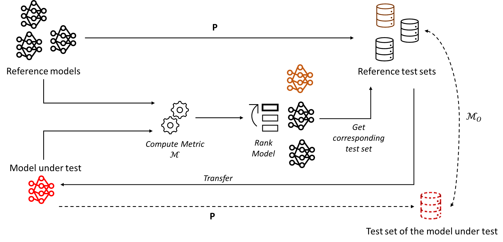

## Replication package for "GIST: Generated Inputs Sets Transferability in Deep Learning"

This replication package contains the artifact associated with the paper "GIST: Generated Inputs Sets Transferability in Deep Learning" in order to help in replicating the results.

**A preprint version of the paper is available on [arxiv]()**

## Test transfer in a nutshell



The idea of test transfer is simple: If one already generated a bunch of test sets with the same procedure P for some models, given a new model under test we would like to test, which of those test sets would be the "best" to apply to this model under test. By "best" we mean the one that behaves similarly according to some property (M_O) compared to a hypothetical test set that would have been generated using the procedure P on the model under test. We invite readers who want to know more to read the preprint version.

*GIST* is a general framework, i.e. the properties M_O and M can be any that are desired. But to assess the framework, we experimented on a particular set (M_O, M), which this replication package is for.

## Demo notebook

A notebook for demonstration of the method is available in the repository `demo/` (`demo.ipynb`). It shows GIST working with a simple example and can also serve as a basic skeleton for customization for other properties or proxies. 

The demo only requires Python, basic packages scientific packages (numpy, matplotlib and scipy) and the data used which can be downloaded on [Zenodo]() along with this repository.

## A note on replication

In order to replicate the results, you must first download the artifacts. We provide Zenodo links to download them. Once downloaded, extract each file to the corresponding repository:

* [**data**](): Contains the generated test sets for both datasets as well as the used procedure (Fuzzing, ...)

* [**models**](): All the model seeds used in our experiments.

* [**pred_sets**](): The extracted predictions and features for each test set are applied to each model.

Once done, you can run the different scrips (see below) and you should obtain similar results. While we fixed as much as possible the seeds, there might be some differences as some operations aren't 100% deterministic (e.g. the UMAP). However, results should be very similar.

## Index

* [Requirements](#requirements)
* [Training the models](#training-the-models)
* [Procedures used for test sets generation](#procedures-used)
* [Setup for replication](#setup)
* [Clustering](#clustering)
* [Research Questions](#research-questions)

## Requirements

Requires Python >= 3.8

<details>
<summary>List of requirements (click to open/collapse)</summary>

name: gist

channels:
  - pytorch
  - defaults

dependencies:
  - _libgcc_mutex=0.1=main
  - _openmp_mutex=5.1=1_gnu
  - abseil-cpp=20211102.0=hd4dd3e8_0
  - aiohttp=3.8.3=py38h5eee18b_0
  - aiosignal=1.2.0=pyhd3eb1b0_0
  - arrow-cpp=11.0.0=py38h613000e_0
  - async-timeout=4.0.2=py38h06a4308_0
  - attrs=22.1.0=py38h06a4308_0
  - aws-c-common=0.4.57=he6710b0_1
  - aws-c-event-stream=0.1.6=h2531618_5
  - aws-checksums=0.1.9=he6710b0_0
  - aws-sdk-cpp=1.8.185=hce553d0_0
  - blas=1.0=mkl
  - boost-cpp=1.73.0=h7f8727e_12
  - bottleneck=1.3.5=py38h7deecbd_0
  - brotlipy=0.7.0=py38h27cfd23_1003
  - bzip2=1.0.8=h7b6447c_0
  - c-ares=1.19.0=h5eee18b_0
  - ca-certificates=2023.01.10=h06a4308_0
  - certifi=2023.5.7=py38h06a4308_0
  - cffi=1.15.1=py38h5eee18b_3
  - charset-normalizer=2.0.4=pyhd3eb1b0_0
  - cryptography=39.0.1=py38h9ce1e76_0
  - cudatoolkit=11.3.1=h2bc3f7f_2
  - ffmpeg=4.3=hf484d3e_0
  - filelock=3.9.0=py38h06a4308_0
  - freetype=2.12.1=h4a9f257_0
  - frozenlist=1.3.3=py38h5eee18b_0
  - fsspec=2023.4.0=py38h06a4308_0
  - gflags=2.2.2=he6710b0_0
  - giflib=5.2.1=h5eee18b_3
  - glog=0.5.0=h2531618_0
  - gmp=6.2.1=h295c915_3
  - gnutls=3.6.15=he1e5248_0
  - grpc-cpp=1.46.1=h33aed49_1
  - icu=58.2=he6710b0_3
  - idna=3.4=py38h06a4308_0
  - intel-openmp=2023.1.0=hdb19cb5_46305
  - jpeg=9e=h5eee18b_1
  - krb5=1.19.4=h568e23c_0
  - lame=3.100=h7b6447c_0
  - lcms2=2.12=h3be6417_0
  - ld_impl_linux-64=2.38=h1181459_1
  - lerc=3.0=h295c915_0
  - libboost=1.73.0=h28710b8_12
  - libbrotlicommon=1.0.9=h5eee18b_7
  - libbrotlidec=1.0.9=h5eee18b_7
  - libbrotlienc=1.0.9=h5eee18b_7
  - libcurl=7.88.1=h91b91d3_0
  - libdeflate=1.17=h5eee18b_0
  - libedit=3.1.20221030=h5eee18b_0
  - libev=4.33=h7f8727e_1
  - libevent=2.1.12=h8f2d780_0
  - libffi=3.4.4=h6a678d5_0
  - libgcc-ng=11.2.0=h1234567_1
  - libgomp=11.2.0=h1234567_1
  - libiconv=1.16=h7f8727e_2
  - libidn2=2.3.2=h7f8727e_0
  - libnghttp2=1.46.0=hce63b2e_0
  - libpng=1.6.39=h5eee18b_0
  - libprotobuf=3.20.3=he621ea3_0
  - libssh2=1.10.0=h8f2d780_0
  - libstdcxx-ng=11.2.0=h1234567_1
  - libtasn1=4.19.0=h5eee18b_0
  - libthrift=0.15.0=hcc01f38_0
  - libtiff=4.5.0=h6a678d5_2
  - libunistring=0.9.10=h27cfd23_0
  - libwebp=1.2.4=h11a3e52_1
  - libwebp-base=1.2.4=h5eee18b_1
  - lz4-c=1.9.4=h6a678d5_0
  - mkl=2023.1.0=h6d00ec8_46342
  - mkl-service=2.4.0=py38h5eee18b_1
  - mkl_fft=1.3.6=py38h417a72b_1
  - mkl_random=1.2.2=py38h417a72b_1
  - multidict=6.0.2=py38h5eee18b_0
  - ncurses=6.4=h6a678d5_0
  - nettle=3.7.3=hbbd107a_1
  - numexpr=2.8.4=py38hc78ab66_1
  - openh264=2.1.1=h4ff587b_0
  - openssl=1.1.1t=h7f8727e_0
  - orc=1.7.4=hb3bc3d3_1
  - packaging=23.0=py38h06a4308_0
  - pandas=1.5.3=py38h417a72b_0
  - pillow=9.4.0=py38h6a678d5_0
  - pip=23.0.1=py38h06a4308_0
  - pyarrow=11.0.0=py38h992f0b0_0
  - pycparser=2.21=pyhd3eb1b0_0
  - pyopenssl=23.0.0=py38h06a4308_0
  - pysocks=1.7.1=py38h06a4308_0
  - python=3.8.16=h7a1cb2a_3
  - python-dateutil=2.8.2=pyhd3eb1b0_0
  - python-xxhash=2.0.2=py38h5eee18b_1
  - pytorch=1.12.1=py3.8_cuda11.3_cudnn8.3.2_0
  - pytorch-mutex=1.0=cuda
  - pytz=2022.7=py38h06a4308_0
  - pyyaml=6.0=py38h5eee18b_1
  - re2=2022.04.01=h295c915_0
  - readline=8.2=h5eee18b_0
  - regex=2022.7.9=py38h5eee18b_0
  - requests=2.29.0=py38h06a4308_0
  - responses=0.13.3=pyhd3eb1b0_0
  - setuptools=66.0.0=py38h06a4308_0
  - six=1.16.0=pyhd3eb1b0_1
  - snappy=1.1.9=h295c915_0
  - sqlite=3.41.2=h5eee18b_0
  - tbb=2021.8.0=hdb19cb5_0
  - tk=8.6.12=h1ccaba5_0
  - tokenizers=0.11.4=py38h3dcd8bd_1
  - torchaudio=0.12.1=py38_cu113
  - torchvision=0.13.1=py38_cu113
  - tqdm=4.65.0=py38hb070fc8_0
  - typing-extensions=4.5.0=py38h06a4308_0
  - typing_extensions=4.5.0=py38h06a4308_0
  - urllib3=1.26.15=py38h06a4308_0
  - utf8proc=2.6.1=h27cfd23_0
  - wheel=0.38.4=py38h06a4308_0
  - xxhash=0.8.0=h7f8727e_3
  - xz=5.4.2=h5eee18b_0
  - yaml=0.2.5=h7b6447c_0
  - yarl=1.8.1=py38h5eee18b_0
  - zlib=1.2.13=h5eee18b_0
  - zstd=1.5.5=hc292b87_0
  - pip:
      - about-time==4.2.1
      - absl-py==1.4.0
      - accelerate==0.21.0
      - alive-progress==3.1.4
      - anytree==2.9.0
      - autograd==1.6.2
      - beautifulsoup4==4.12.2
      - bert-score==0.3.13
      - boto3==1.28.28
      - botocore==1.31.28
      - bpemb==0.3.4
      - cachetools==5.3.1
      - click==8.0.4
      - cloudpickle==2.2.1
      - cma==3.2.2
      - conllu==4.5.3
      - contourpy==1.0.7
      - cupy-cuda113==10.6.0
      - cycler==0.11.0
      - cython==0.29.35
      - datasets==2.4.0
      - deprecated==1.2.14
      - dill==0.3.5.1
      - docopt==0.6.2
      - easydict==1.10
      - editdistance==0.6.2
      - fastrlock==0.8.1
      - flair==0.12.2
      - fonttools==4.39.4
      - ftfy==6.1.1
      - future==0.18.3
      - gdown==4.4.0
      - gensim==4.3.1
      - google-auth==2.21.0
      - google-auth-oauthlib==1.0.0
      - grapheme==0.6.0
      - grpcio==1.56.0
      - hdbscan==0.8.29
      - huggingface-hub==0.16.4
      - hyperopt==0.2.7
      - imageio==2.31.2
      - importlib-metadata==6.6.0
      - importlib-resources==5.12.0
      - janome==0.5.0
      - jieba==0.42.1
      - jmespath==1.0.1
      - joblib==1.2.0
      - kiwisolver==1.4.4
      - langdetect==1.0.9
      - language-tool-python==2.7.1
      - lazy-loader==0.3
      - lemminflect==0.2.3
      - llvmlite==0.40.0
      - lru-dict==1.2.0
      - lxml==4.9.3
      - markdown==3.4.3
      - markupsafe==2.1.3
      - matplotlib==3.7.1
      - more-itertools==10.1.0
      - mpld3==0.3
      - multiprocess==0.70.13
      - networkx==3.1
      - nltk==3.8.1
      - num2words==0.5.12
      - numba==0.57.0
      - numpy==1.24.4
      - oauthlib==3.2.2
      - openhownet==2.0
      - pinyin==0.4.0
      - pptree==3.1
      - protobuf==4.23.3
      - psutil==5.9.5
      - py4j==0.10.9.7
      - pyasn1==0.5.0
      - pyasn1-modules==0.3.0
      - pycld2==0.41
      - pymoo==0.6.0.1
      - pynndescent==0.5.10
      - pynvml==11.5.0
      - pyparsing==3.0.9
      - pytorch-revgrad==0.2.0
      - pywavelets==1.4.1
      - requests-oauthlib==1.3.1
      - rsa==4.9
      - s3transfer==0.6.2
      - safetensors==0.3.2
      - scikit-image==0.21.0
      - scikit-learn==1.2.2
      - scipy==1.10.1
      - seaborn==0.12.2
      - segtok==1.5.11
      - sentencepiece==0.1.99
      - smart-open==6.3.0
      - soupsieve==2.4.1
      - sqlitedict==2.1.0
      - tabulate==0.9.0
      - tensorboard==2.13.0
      - tensorboard-data-server==0.7.1
      - terminaltables==3.1.10
      - textattack==0.3.8
      - threadpoolctl==3.1.0
      - tifffile==2023.7.10
      - torchtext==0.13.1
      - transformer-smaller-training-vocab==0.2.4
      - transformers==4.31.0
      - umap-learn==0.5.3
      - wcwidth==0.2.6
      - werkzeug==2.3.6
      - wikipedia-api==0.6.0
      - word2number==1.1
      - wrapt==1.15.0
      - zipp==3.15.0
</details>

## Training the models

Models are provided (see previous parts). If you wish to retrain them from scratch the models, we used two libraries:

* For CIFAR10: We used [CIFAR-ZOO](https://github.com/BIGBALLON/CIFAR-ZOO) implementations of the models. We kept the same hyperparameters as they did with the exception of the number of epochs (300 -> 50) and the epochs to change the learning rate ([150, 225] -> [20, 40]) in order to fasten computation. 

* For Movie Review: We used some models provided by [HuggingFace](https://huggingface.co/). We used every time a pre-trained version of the model (along with the tokenizer coming with it) that we further fine-tuned on the dataset for 5 epochs. We used the following hyperparameters:

    * Optimizer: AdamW
    * Scheduler: Linear with warmup (10% of the steps)
    * Learning rate: 2e-6 (BERT, RoBERTa), 3e-6 (XLNet), 1e-5 (Electra) and 5e-6 (DistilBERT)
    * Batch Size: 16 for all except for Electra (32)

The choice was motivated based on similar models from HuggingFace. We obtain the accuracy presented in the paper. The datasets used are the CIFAR10 dataset provided by PyTorch and the rotten_tomatoes dataset provided by HuggingFace.

## Procedures used

* Fuzzing: We used the procedure described in [QuoTe: Quality-oriented Testing for Deep Learning Systems](https://dl.acm.org/doi/full/10.1145/3582573) in Algorithm 3. We only used the part with FOL_max. We used the same hyperparameters they used in their paper but we reduced the epsilon (controlling the noise) to *0.05*.

* GAN: We used the procedure described in [Exposing previously undetectable faults in deep neural networks](https://dl.acm.org/doi/10.1145/3460319.3464801) by adapting their [artifacts](https://zenodo.org/record/4769742). We let the default parameters they used. For the BigGAN required in the procedure, we used the checkpoint and implementation of [MMGeneration](https://github.com/open-mmlab/mmgeneration).

* Text: We used the [TextAttack](https://github.com/QData/TextAttack) library and implemented a Custom Attack following the description presented in [Reevaluating Adversarial Examples in Natural Language](https://aclanthology.org/2020.findings-emnlp.341/).

The obtained test data generated on each of the models can be downloaded (see *A note on Replication*). For the *Text* procedure, the scrapped data used can be found in the `data/mr/scrapped_review/` folder. It's a `.arrow` file and can be opened using `TextAttack` dataset utility.

**DISCLAIMER FOR THE SCRAPPED DATA: ** Data were scrapped from publically available reviews of rotten tomatoes for research purposes only. Data were taken as they were on the website and no further modifications were applied, besides removing some data based on a review score threshold as described in the paper. As such, no moderation filtering on the review was done on top of the existing one from rotten tomatoes. Use at your own discretion.

## Setup

In order to answer our research questions, we first had to follow the steps detailed in our methodology, i.e. generate for each model the test sets for each procedure, extract prediction/features and cluster for each model under test/procedure. Note that if you download all the required files (see *A note on replication*), you will not need to do that.

### Extracting features/prediction

Given the models and generated test sets, one can use the script `generate_pred_sets.py` in order to obtain the features needed. Note that those obtained feature files are part of what is downloaded in the [**pred_sets**]() repository on Zenodo.

Usage of the script is:

```
usage: generate_pred_sets.py [-h] [-m MODEL [MODEL ...]] [-d DATASET] [-t TYPE] [-tm TARGET_MODEL] [-b BATCH_SIZE] [--device DEVICE] [--override]

optional arguments:
  -h, --help            show this help message and exit
  -m MODEL [MODEL ...], --model MODEL [MODEL ...]
                        Model to use for computation. By default, will use ALL registered models for the given dataset. If given, will use only the provided
                        list of models (e.g. --model preresnet20 vgg19). All instances (i.e. seed) trained are used, e.g. --model vgg19 will use vgg19_0,
                        vgg19_1, ...
  -d DATASET, --dataset DATASET
                        Dataset to use for computation
  -t TYPE, --type TYPE  Test set type (train, fuzz, gen)
  -tm TARGET_MODEL, --target_model TARGET_MODEL
                        Model to be tested on a generated dataset of all models provided with --model argument, e.g --target_model vgg19_0, will test
                        generated dataset from all instances of all model seeds (except vgg19 ones) on vgg19_0.
  -b BATCH_SIZE, --batch_size BATCH_SIZE
  --device DEVICE
  --override
```

Basic usage is:

```
python generate_pred_sets.py -d cifar10 -t fuzz -tm preresnet110_0 -b 128 --device cuda
```

This will extract the features files from the model *PreResnet110* (seed 0) (i.e. the target) by using all other models (except *PreResnet110*) generated fuzz test sets and save it in a numpy array name `preresnet110_0_fuzz_X.npz` inside the `pred_sets/cifar10/` directory, where X is the name of model from which we used the test set (e.g. `preresnet20_0`). The batch size is set to 128 and it uses GPU acceleration. This must be done on all models, both being or not being a target. This will allow us to experimentally verify that a given metric M works for all models, by considering them alternately to be the model under test. Note that it will skip the extraction if the file already exists unless the argument `--override` is provided.

## Clustering

Once the features are extracted, we will use the clustering pipeline described. To do so, we use the script `clustering.py` which usage is:

```
usage: clustering.py [-h] [-r REF_MODEL [REF_MODEL ...]] [-o OBJ_MODEL] [-i IND] [-d DATASET] [-t TYPE] [--save_mod] [--save_clust]

optional arguments:
  -h, --help            show this help message and exit
  -r REF_MODEL [REF_MODEL ...], --ref_model REF_MODEL [REF_MODEL ...]
                        List of reference models to use. By default, will use all models except eventually the objective model.
  -o OBJ_MODEL, --obj_model OBJ_MODEL
                        Objective model to compare to reference
  -i IND, --ind IND     Random instance among objective model to use
  -d DATASET, --dataset DATASET
                        Dataset to use for computation
  -t TYPE, --type TYPE  Test set type (fuzz or gen)
  --save_mod            save models
  --save_clust          save data from clusters. Only for calculating accuracy
```

Where basic usage is:

```
python clustering.py -d cifar10 -t fuzz -o preresnet110 -i 0
```

This will calculate the clusters using *PreResnet110* (seed 0) as the model under test, pooling all the extracted features of the fuzz procedures that were computed previously. The results will be saved as a `.json` file in the corresponding `pred_sets/` directory and start as `cov_type2_...`. The option `--save_mod` allows to saving of the UMAP and HBSCAN models if needed and `--save_clust` allows saving the data themselves in the clusters which are needed to evaluate the accuracy over clusters (see *Clusters Validations* below), saving the data in the `data/` directory (name starting with `data_cov_X.npz`). The hyperparameters used are present in this script as well. Readers can find in the `results_files/` directory the obtained results (DBCV, silhouette score...) we obtained in our experiments for each of the procedures.

# Research Questions

## Clusters Validations

In our paper, we first applied the clustering method and verified that it corresponds to different fault types similar to [Black-Box Testing of Deep Neural Networks through Test Case Diversity](https://ieeexplore.ieee.org/abstract/document/10041782). 

To run the clustering procedure, one needs to generate the relevant data for each cluster as described previously (not needed if data were downloaded). We then used `generate_split_original_test_set.py` to generate the relevant splits needed, taking the five biggest clusters.

For instance:

```
python generate_split_original_test_set.py -d cifar10 -t fuzz -o densenet100bc -i 1 -c 0
```

will generate the three splits for the biggest clusters (i.e. number 0) for *Densenet100bc* (seed 1), along with what input seeds to use for training (85% of them) or for calculating later accuracy (15% of them). The actual number of the cluster will be returned in the terminal and will be different from the one provided by `-c` (since here it's the index of the clusters ranked by the number of data while the clustering assigned a different number)

Once the splits are generated, the model needs to be retrained using each of those splits (and for each of the clusters we wish to evaluate accuracy). We provided them in the [**models**]() repository on Zenodo.

Finally, using the script `calculate_clusters_accuracy.py`, one can obtain the in/out cluster's accuracy leading to the results we presented in Table 2 in our paper. For instance:

```
python calculate_clusters_accuracy.py -d cifar10 -t fuzz -o densenet100bc -i 1 --cluster 31 --device cuda
```

will return

```
Calculating...
Working on split 0
Fuzz dataset size for model densenet100bc_1 is 10244 
Working on split 1
Fuzz dataset size for model densenet100bc_1 is 10244 
Working on split 2
Fuzz dataset size for model densenet100bc_1 is 10244 
Using cluster 31, average over 3 splits
Averaged pct of faults reduced (non-covered cluster) in dat aug:  0.7407407407407408
Averaged pct of faults reduced (non-covered cluster) not in dat aug:  0.1029253710953912
#####################################
```

which gives the accuracy on the remaining 15% of cluster 31 (here 74.07%) and the average on the other clusters (here 10.29%), all results being averaged over the 3 splits.

## RQ1: For a given objective model, do some test sets cover similar fault types depending on their reference model type?

The figures in RQ1 were obtained using the `dendrogram.py` script. For instance, Figure 2 was obtained with:

```
python dendrogram.py -d cifar10 -t fuzz -o densenet100bc -i 1
```

Note that, as we wrote in the paper, the thresholds to cluster here are subjective and were done so in order to make the figure easily readable. Yet, if running with another model, the manually chosen threshold can lead to inconsistent clusters and so should be changed. It has no impact since this is mainly used to be able to interpret the figure. 

## RQ2: Are some test sets more likely to increase fault types coverage on an objective model depending on the reference model they were generated on?

The heatmaps in RQ2 were obtained using `grouped_faults.py`, however, you first need to calculate the matrix for the heatmap. To do so, one needs to execute the following command for all models under test:

```
python grouped_faults.py -d cifar10 -t fuzz -o densenet100bc -i 1
```

If the matrix doesn't exist, it will be created. Note however it does NOT check if the matrix has already been populated or not if it exists, so running it might add more values than needed. The data needed is available to download in the [**data**]() repository on Zenodo.

Once it's done, to display the heatmap, one can just do:

```
python grouped_faults.py -d cifar10 -t fuzz --heatmap
```

which will display the heatmap of Figure 5.

## RQ3: Can introduced similarity metrics be used as a proxy for fault types covered?

To obtain the correlations, one must run the script `compute_corr.py`. This script provides all the results for RQ3 and RQ4. It will return the correlation between the similarity metrics M and the fault types coverage M_O for each metric that is used in RQ3. Moreover, it also calculates the Top-1 and Top-5 metrics we described in the paper, as well as the Overall Best First and Each Best First criteria for RQ4. To execute it, one can run:

```
python compute_corr.py -d cifar10 -t fuzz -o densenet100bc -i 0
```

If `--save` is provided, the results will be added to a `.csv` file named `res.csv`. Note that, since it only ADDS the results, one has to be careful if some results already have been computed. It does not delete the files before executing nor doesn't it check whether the file is already populated or not. The `res.csv` file will contain the data needed to obtain Table 3 in our paper. It needs to be done for all models under test and all procedures in order to have the same Table 3. We provide said data in `results_files/`, in each `res_PROCEDURE.csv` file.

Each `res_PROCEDURE.csv` is structured as follow: each row is the result for a model under test seed for a given similarity metric. It is structured in block of 6 rows (one for each metric), e.g. the first 6 rows are the results for the 6 metrics (PWCCA, CKA, Ortho, Acc, Dis and JDiv) for Densenet100bc seed 0, then the 6 next are for the 6 metrics for Densenet100bc seed 1, ...etc Available data are the obtained Kendall-tau, the associated p-value, the Top-1 and Top-5 criterion as well as the fault type coverage value obtained for the Top-1 and Top-5 criteria.

If `--plot` is given, the data will be plotted to examine the correlation. 

## RQ4: Can we leverage similarity metrics and fault types structure to operationalize test transfer?

The first part of RQ4 (Table 4) uses the same data from the previous `res.csv` files (that we saved in `results_files/`).

The second part of RQ4 (Table 5) uses the other generated `.csv` file i.e. `res_mult.csv` where the users can find the fault types coverage using the Overall Best First and Each Best First criteria for k = {2, 3 4}. We also provided those files in the directory `results_files/` with `res_mult_PROCEDURE.csv`.

Each `res_mult_PROCEDURE.csv` is structured similarly as the `res_PROCEDURE.csv` files, with the same block structure of size 6. Available data are the obtained fault types coveraged by combining k = {2, 3, 4} test sets using EBF criterion and by combining k = {2, 3, 4} test sets using the OBF criterion.
